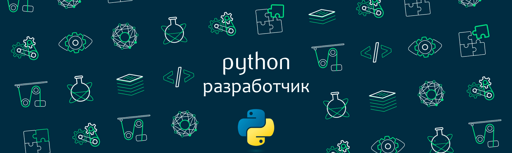
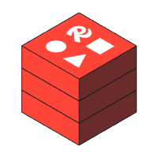
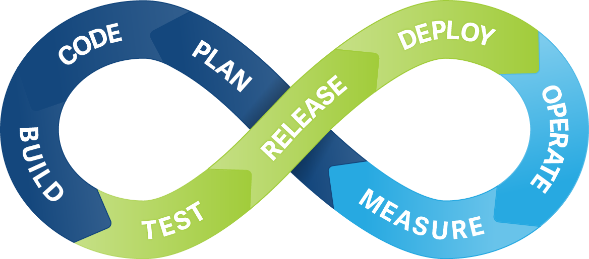

<h1 align="center">Александр Коршунов </h1>

 🧑‍💻 Я backend-разработчик, специализируюсь на Python. 
Нравится писать чистый и эффективный код на Python, решать алгоритмы и постоянно улучшать свои навыки!

<h3 align="left">💡 Технлогии и Инструменты:</h3>

<h3 align="left">👨‍💻 Мои проекты:</h3>

 

  
Проекты

   <ul>
    <li><a href="https://github.com/AleksandrKorshun92/double_website">Веб-приложение для отслеживания судебных заседаний в одном окне </a></li>
     

      
Описание

       <b>&nbsp;&nbsp;&nbsp;&nbsp;Задача:</b>
        <ul><ul>
         <li>Разработать backend-часть для процесса отслеживания судебных заседаний в арбитражных судах.</li>
        </ul></ul>
       <b>&nbsp;&nbsp;&nbsp;&nbsp;Результаты:</b>
        <ul><ul>
         <li>Реализовал регистрацию пользователей и аутентификацию, через django.contrib.auth;</li>
         <li>Добавил функционал управления отслеживания залов судебных заседаний (добавление новых залов, изменение, удаление);</li>
         <li>Реализовал  возможность просмотра судебных дел в настоящую дату;</li>
         <li>Настроил базу данных, для сохранение данных через интерфейсы SQLAlchemy с SQLite;</li>
         <li>Сделал fronted-часть приложения;</li>
         <li>Реализовал развертывание проекта через Docker Compose с использованием Nginx.</li>
        </ul></ul>
       <b>&nbsp;&nbsp;&nbsp;&nbsp;<u>Используемые технологии:</u></b>
        <ul><ul>
         <li>Python, Django, Django REST Framework,Docker, Pytest, django-baton, Nginx, SQLite.</li>
        </ul></ul>&nbsp;
     

    <li><a href="https://github.com/AleksandrKorshun92/tg_bot">TG бот для юриста</a></li> 
     

      
Описание

       <b>&nbsp;&nbsp;&nbsp;&nbsp;<u>Задача:</u></b>
        <ul><ul>
         <li>Разработать Телеграмм бота для взпимодействия с клиентами.</li>
        </ul></ul>
       <b>&nbsp;&nbsp;&nbsp;&nbsp;<u>Результаты:</u></b>
        <ul><ul>
         <li>Реализовал бота для создания, просмотра и управления услугами юриста на основе Aiogram;</li>
         <li>Подключил базу данных SQLite для записи новых клиентов, отслежования задач и встреч;</li>
         <li>Настроил асинхронную отправку сообщений от администратора пользователям;</li>
         <li>Сделал мониторинг задач;</li>
         <li>Реализовал запуск проекта с использованием Docker Compose.</li>
        </ul></ul>
       <b>&nbsp;&nbsp;&nbsp;&nbsp;<u>Используемые технологии:</u></b>
        <ul><ul>
         <li>Python, Aiogram, SQLite, Docker, API Telegram</li>
        </ul></ul>&nbsp;
     

      </ul>
 

<h3 align="left"> 📲 Связаться со мной:</h3>

 
 

 
<h3 align="left">📈 GitHub:</h3>
<table>
  <tr>
    <td>
      
    </td>
  </tr>
</table>

